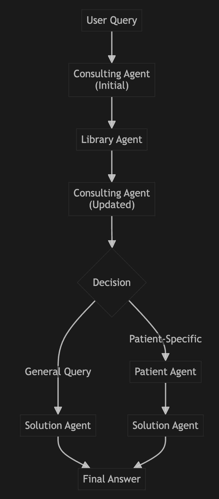

# Multi-Agent Medical Consultation System

An intelligent multi-agent system that combines patient data analysis with medical literature research to provide comprehensive medical insights and recommendations.

## 🏥 System Overview

This system orchestrates four specialized AI agents to provide comprehensive medical consultations:





### Challenges I have faced
1. Long PDF doc: chunking-based RAG technique
2. Long patient records: intelligent data extraction using LLM: LLM determine which key to find, then calling a fun to extract record directly, without the requirement of scanning all patient json. (Improvement: better context retrieval method)
3. Consultant agent lack of domain knowledge: RAG as external knowledge


### 🎯 Key Features

- **Natural Language Processing**: Understands complex medical questions in plain English
- **Intelligent Data Extraction**: 72% reduction in context usage through smart field selection
- **Evidence-Based Medicine**: Integrates patient data with medical literature research
- **Semantic Search**: Advanced PDF processing with vector-based document search
- **Clinical Confidence Scoring**: Provides confidence assessment for medical recommendations
- **Source Attribution**: Maintains proper medical citations and references

## 📋 Prerequisites

1. **Python 3.8+** with required packages:
   ```bash
    /usr/bin/python3 -m venv ./
    source ./bin/activate
    pip install -U langchain langchain_openai langsmith pandas langchain_experimental matplotlib langgraph langchain_core
    pip install PyPDF2
    pip install frontend
    pip install pymupdf
    pip install faiss-cpu
    export OPENAI_API_KEY=
   ```

2. **OpenAI API Key**: Get from [OpenAI Platform](https://platform.openai.com/api-keys)
   ```bash
   export OPENAI_API_KEY='your-api-key-here'
   ```

3. **Patient Data**: JSON file with patient medical records (`patients.json`)

4. **Medical Literature** (Optional): PDF documents with medical guidelines, research papers

## 🚀 Quick Start

### Basic Usage

```python
from multiagent_system import MultiAgentSystem

# Initialize the system
system = MultiAgentSystem(
    openai_api_key="your-api-key",
    patients_json_path="./patients.json"
)

# Patient-specific consultation
result = system.process_medical_query(
    user_query="What are the cardiovascular risk factors for this patient?",
    patient_id="p_001",
    pdf_documents=["./medical_guidelines.pdf"]
)

print(result['final_solution'])
```

### Run Example Script

```bash
python example_usage.py
```

## 📖 Detailed Usage

### 1. Patient-Specific Queries

Analyze individual patient data with medical literature support:

```python
# Example: Medication analysis
query = "What drug interactions should I be aware of for patient p_001's current medications?"

result = system.process_medical_query(
    user_query=query,
    patient_id="p_001",
    pdf_documents=["./drug_interactions.pdf"]
)
```

**Sample Patient Queries:**
- "What are the patient's current cardiovascular risk factors?"
- "Show me recent lab results and their clinical significance"
- "What allergies and contraindications should I consider?"
- "Provide a comprehensive medical summary for this patient"

### 2. General Medical Research

Research-based medical recommendations without patient context:

```python
# Example: Treatment protocols
query = "What are the latest evidence-based treatments for acute heart failure?"

result = system.process_medical_query(
    user_query=query,
    patient_id=None,  # No specific patient
    pdf_documents=["./cardiology_guidelines.pdf"]
)
```

**Sample Research Queries:**
- "What are the current guidelines for diabetes management?"
- "Latest protocols for antibiotic resistance in ICU settings"
- "Evidence-based approaches to pain management in oncology"

### 3. Integrated Consultations

Combine patient-specific data with evidence-based research:

```python
# Example: Personalized treatment recommendations
query = """Based on this patient's lung cancer diagnosis and current medications, 
          what are the evidence-based treatment options and potential complications?"""

result = system.process_medical_query(
    user_query=query,
    patient_id="p_001",
    pdf_documents=["./oncology_protocols.pdf", "./drug_interactions.pdf"]
)
```

## 🧠 Agent Descriptions

### 1. Consulting Agent 🩺
- **Role**: Senior Medical Analyst
- **Function**: Analyzes medical queries and develops clinical strategy
- **Output**: Clinical analysis, patient data queries, literature search strategy

### 2. Patient Agent 📋
- **Role**: Medical Records Specialist  
- **Function**: Extracts and analyzes patient-specific medical data
- **Output**: Patient findings, clinical interpretations, medical trends

### 3. Library Agent 📚
- **Role**: Medical Research Librarian
- **Function**: Semantic search through medical literature and PDFs
- **Output**: Evidence-based findings, source references, relevance scores

### 4. Solution Agent 🏥
- **Role**: Senior Consulting Physician
- **Function**: Synthesizes all information into comprehensive recommendations
- **Output**: Clinical recommendations, confidence assessment, safety considerations

## 📊 System Performance

### Context Optimization
- **Before**: 1,061 characters for medication data
- **After**: 295 characters (72% reduction)
- **Method**: Intelligent field extraction based on query analysis

### Confidence Scoring
- **High (90%+)**: Both patient data and literature evidence available
- **Medium (70%)**: Single source of information
- **Low (50%)**: Limited information available

## 📁 File Structure

```
📦 medisult/
├── 📄 multiagent_system.py          # Main multi-agent orchestration
├── 📄 patient_scanning_agent.py     # Patient data extraction & analysis
├── 📄 enhanced_library_agent.py     # Medical literature search
├── 📄 example_usage.py              # Usage demonstration
├── 📄 README.md                     # This documentation
├── 📄 patients.json                 # Patient medical records (your data)
└── 📁 pdfs/                         # Medical literature documents
    ├── 📄 medical_guidelines.pdf
    ├── 📄 drug_interactions.pdf
    └── 📄 clinical_protocols.pdf
```

## 🔧 Configuration Options

### Model Selection
```python
# For best medical accuracy
system = MultiAgentSystem(model_name="gpt-4")

# For faster processing
system = MultiAgentSystem(model_name="gpt-3.5-turbo")
```

### Patient Query Agent (Standalone)
```python
from patient_scanning_agent import PatientQueryAgent

# Initialize with AI capabilities
agent = PatientQueryAgent(
    json_file_path="./patients.json",
    openai_api_key="your-api-key",
    model_name="gpt-4"
)

# Natural language query
answer = agent.ask_about_patient(
    "What medications is this patient taking?",
    patient_id="p_001"
)
```

### Enhanced Library Agent (Standalone)
```python
from enhanced_library_agent import EnhancedLibraryAgent

# Initialize for document processing
library = EnhancedLibraryAgent("your-api-key")

# Process medical documents
library.process_documents(["./medical_guidelines.pdf"])

# Semantic search
results = library.semantic_search("heart failure treatment", k=5)
```

## ⚠️ Important Notes

### Medical Disclaimer
- **Educational Purpose**: This system is for educational and research purposes only
- **Professional Consultation**: Always consult qualified healthcare professionals for medical decisions
- **Verification Required**: Verify all recommendations with current medical guidelines
- **No Substitute**: This system is not a substitute for professional medical judgment

### Privacy & Security
- **HIPAA Compliance**: Ensure compliance with healthcare privacy regulations
- **Data Security**: Secure handling of patient medical information
- **Access Control**: Implement appropriate access controls for medical data
- **Audit Trails**: Maintain logs of system usage for compliance

### Technical Considerations
- **API Costs**: Monitor OpenAI API usage costs for production deployment
- **Rate Limits**: Respect OpenAI API rate limits
- **Error Handling**: Implement robust error handling for production use
- **Scalability**: Consider caching and optimization for large-scale deployment

## 🔄 Version History

### Version 2.0 (Current)
- ✅ Integrated multi-agent medical consultation system
- ✅ Context optimization (72% reduction in token usage)
- ✅ Sequential workflow to prevent state conflicts
- ✅ Enhanced medical prompts and analysis
- ✅ Comprehensive documentation and examples

### Version 1.0
- ✅ Basic patient data scanning
- ✅ Simple query processing
- ✅ PDF document search capabilities

## 🤝 Contributing

1. Fork the repository
2. Create a feature branch (`git checkout -b feature/medical-enhancement`)
3. Commit your changes (`git commit -am 'Add medical enhancement'`)
4. Push to the branch (`git push origin feature/medical-enhancement`)
5. Create a Pull Request

## 📄 License

This project is licensed under the MIT License - see the LICENSE file for details.

## 📞 Support

For questions, issues, or contributions:
- Create an issue on GitHub
- Review the documentation and examples
- Check the troubleshooting section below

## 🔍 Troubleshooting

### Common Issues

1. **"Patient not found"**
   - Verify patient ID exists in patients.json
   - Check JSON file format and structure

2. **"No API key found"**
   - Set environment variable: `export OPENAI_API_KEY='your-key'`
   - Or pass directly to system initialization

3. **"PDF processing failed"**
   - Ensure PDF files are readable and not password-protected
   - Check file paths are correct

4. **"Context length exceeded"**
   - System automatically optimizes context usage
   - Consider reducing number of PDF documents processed

### Performance Tips

- Use GPT-4 for best medical accuracy
- Limit PDF documents to most relevant sources
- Cache processed documents for repeated queries
- Monitor API usage and costs

---

**🏥 The Multi-Agent Medical Consultation System is ready to assist with evidence-based medical insights!**
